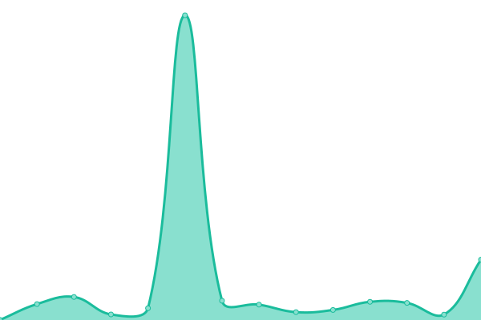
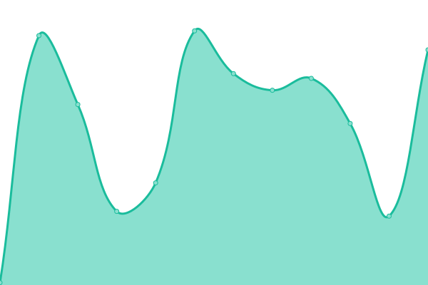
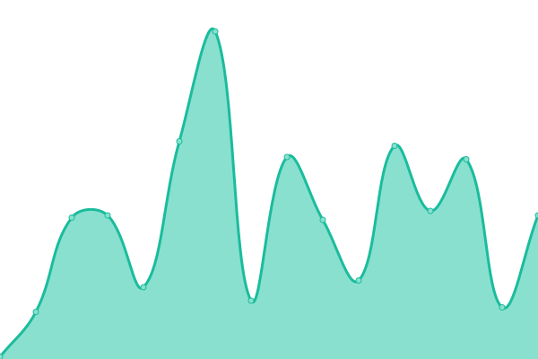

# [📈 Live Status](https://status.opentorc.com): <!--live status--> **🟩 All systems operational**

This repository contains the open-source uptime monitor and status page for [Torc](www.opentorc.com), powered by [Upptime](https://github.com/upptime/upptime).

With [Upptime](https://upptime.js.org), you can get your own unlimited and free uptime monitor and status page, powered entirely by a GitHub repository. We use [Issues](https://github.com/OpenTorc/upptime/issues) as incident reports, [Actions](https://github.com/OpenTorc/upptime/actions) as uptime monitors, and [Pages](https://status.opentorc.com) for the status page.

<!--start: status pages-->
<!-- This summary is generated by Upptime (https://github.com/upptime/upptime) -->
<!-- Do not edit this manually, your changes will be overwritten -->
<!-- prettier-ignore -->
| URL | Status | History | Response Time | Uptime |
| --- | ------ | ------- | ------------- | ------ |
|  [Marketing Site](https://www.opentorc.com) | 🟩 Up | [marketing-site.yml](https://github.com/opentorc/upptime/commits/HEAD/history/marketing-site.yml) | 

 677ms
     
 | 

<a href="https://status.opentorc.com/history/marketing-site">100.00%</a>
    

|  [Platform](https://platform.opentorc.com) | 🟩 Up | [platform.yml](https://github.com/opentorc/upptime/commits/HEAD/history/platform.yml) | 

 97ms
     
 | 

<a href="https://status.opentorc.com/history/platform">100.00%</a>
    

|  [Platform (Staging)](https://platform-staging.opentorc.com) | 🟩 Up | [platform-staging.yml](https://github.com/opentorc/upptime/commits/HEAD/history/platform-staging.yml) | 

 85ms
     
 | 

<a href="https://status.opentorc.com/history/platform-staging">100.00%</a>
    

|  [Platform (Develop)](https://platform-dev.opentorc.com) | 🟩 Up | [platform-develop.yml](https://github.com/opentorc/upptime/commits/HEAD/history/platform-develop.yml) | 

 513ms
     
 | 

<a href="https://status.opentorc.com/history/platform-develop">100.00%</a>
    

|  [Search Tool](https://search.opentorc.com) | 🟩 Up | [search-tool.yml](https://github.com/opentorc/upptime/commits/HEAD/history/search-tool.yml) | 

 484ms
     
 | 

<a href="https://status.opentorc.com/history/search-tool">98.52%</a>
    

|  [Search Tool (Staging)](https://search-staging.opentorc.com) | 🟩 Up | [search-tool-staging.yml](https://github.com/opentorc/upptime/commits/HEAD/history/search-tool-staging.yml) | 

 428ms
     
 | 

<a href="https://status.opentorc.com/history/search-tool-staging">100.00%</a>
    

|  [Search Tool (Develop)](https://search-dev.opentorc.com) | 🟩 Up | [search-tool-develop.yml](https://github.com/opentorc/upptime/commits/HEAD/history/search-tool-develop.yml) | 

 174ms
     
 | 

<a href="https://status.opentorc.com/history/search-tool-develop">95.63%</a>
    

<!--end: status pages-->

[**Visit our status website →**](https://status.opentorc.com)

## 📄 License

- Powered by: [Upptime](https://github.com/upptime/upptime)
- Code: [MIT](./LICENSE) © [Torc](www.opentorc.com)
- Data in the `./history` directory: [Open Database License](https://opendatacommons.org/licenses/odbl/1-0/)
